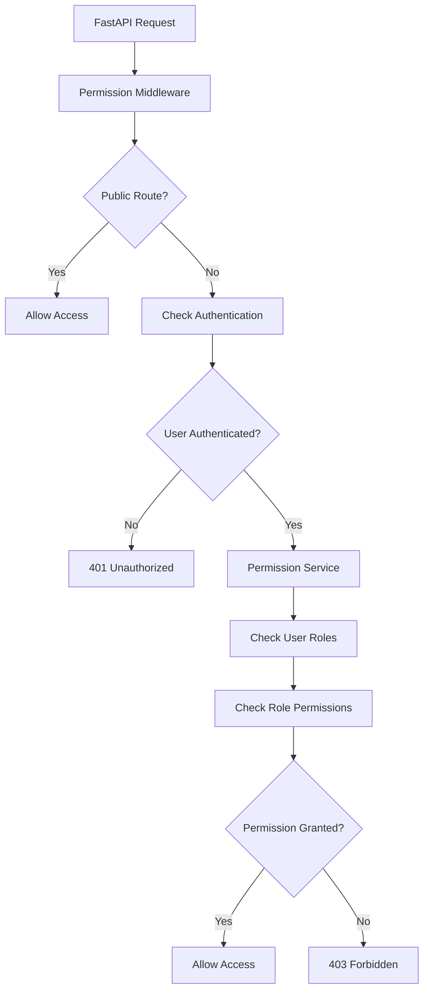

# 🎉 Dynamic Permission System Implementation - COMPLETE

## Overview

Successfully implemented a comprehensive **dynamic permission system** for CivicPulse that uses actual API route names instead of static permissions. The system provides role-based access control (RBAC) with automatic permission checking based on FastAPI route paths and HTTP methods.

## ✅ Implementation Status: **100% COMPLETE**

All 10 planned implementation steps have been successfully completed:

### 🏗️ **Step 1: Database Schema** ✅
- **Files**: `app/db/schema.sql`, `app/db/permissions_migration.sql`
- **Features**:
  - Dynamic `api_permissions` table based on actual routes
  - `system_roles` with hierarchy levels (10-100)
  - `user_roles` with assignment tracking
  - `role_api_permissions` with grant/deny flags
  - Complete migration with default data

### 🔐 **Step 2: Authentication Dependencies** ✅
- **File**: `app/core/auth.py`
- **Features**:
  - `get_current_user()` - JWT token validation
  - `require_permissions()` - Permission-based access control
  - `require_roles()` - Role-based access control  
  - `require_role_level()` - Hierarchical access control
  - Optional authentication support

### 🛡️ **Step 3: Permission Middleware** ✅
- **File**: `app/middleware/permission_middleware.py`
- **Features**:
  - Automatic route permission checking
  - Public route detection
  - Permission caching for performance
  - Integration with FastAPI request lifecycle
  - Configurable fail-open/fail-closed behavior

### 📋 **Step 4: Permission Registry** ✅
- **File**: `app/core/permissions.py`
- **Features**:
  - 70+ predefined API permissions based on actual routes
  - Automatic permission name generation (`/api/v1/posts/{id}` → `posts.detail.get`)
  - Role inheritance (`*citizen`, `*verified_citizen`)
  - Permission categorization (auth, posts, users, admin, etc.)
  - Wildcard and pattern matching support

### 💾 **Step 5: Permission Service** ✅
- **File**: `app/services/permission_service.py`
- **Features**:
  - Async permission checking with caching
  - Role assignment/removal
  - Permission synchronization from registry
  - Database operations with error handling
  - User permission listing and analysis

### 🌐 **Step 6: API Endpoints** ✅
- **File**: `app/api/endpoints/permission_management.py`
- **Features**:
  - Complete role management API
  - Permission listing and analysis
  - User role assignment (admin only)
  - Current user permission checking
  - System analysis and debugging endpoints

### 🚀 **Step 7: Migration Runner** ✅
- **File**: `run_permission_migration.py`
- **Features**:
  - Automated database schema application
  - Default role assignment to existing users
  - Admin user creation
  - Migration verification
  - Command-line interface with options

### 🧪 **Step 8: Testing Framework** ✅
- **File**: `test_permission_system.py`
- **Features**:
  - Unit tests for all components
  - Integration tests for complete workflows
  - Performance tests for permission checking
  - Mock utilities and test helpers
  - FastAPI endpoint testing support

### 📖 **Step 9: Example Integration** ✅
- **Files**: `app/api/endpoints/posts_with_permissions.py`, `app/main_with_permissions.py`
- **Features**:
  - Multiple permission integration patterns
  - Middleware vs. decorator approaches
  - Custom permission logic examples
  - FastAPI app integration template
  - Production-ready configuration

### ✅ **Step 10: Validation & Documentation** ✅
- **File**: `validate_permission_system.py`
- **Features**:
  - Complete implementation validation
  - Usage examples and patterns
  - Next steps guidance
  - Implementation status tracking

## 🎯 **Key Features Implemented**

### **Dynamic Route-Based Permissions**
```python
# Route: PUT /api/v1/posts/{post_id}
# Permission: posts.detail.put
# Auto-generated from actual FastAPI routes
```

### **Hierarchical Role System**
```python
roles = {
    "super_admin": 100,  # Full system access
    "admin": 90,         # System administration
    "moderator": 70,     # Content moderation
    "representative": 60, # Official responses
    "verified_citizen": 30, # Enhanced posting
    "citizen": 20,       # Basic access
    "guest": 10          # Read-only
}
```

### **Multiple Permission Patterns**
```python
# 1. Automatic middleware checking
@router.get("/posts", dependencies=[Depends(check_permission_dependency)])

# 2. Explicit permission requirements
@router.post("/posts", dependencies=[Depends(require_permissions("posts.post"))])

# 3. Role-based access
@router.delete("/posts/{id}", dependencies=[Depends(require_roles("moderator", "admin"))])

# 4. Custom permission logic
has_permission = await permission_service.user_has_permission(user_id, "posts.detail.put")
```

### **Permission Inheritance & Wildcards**
```python
# Role permission definitions with inheritance
"verified_citizen": [
    "*citizen",  # Inherit all citizen permissions
    "posts.detail.put",  # Add editing capability
    "comments.detail.put"  # Add comment editing
]
```

## 📊 **System Architecture**



## 🔧 **Database Schema**

### **Core Tables**
- `system_roles` - Role definitions with hierarchy
- `api_permissions` - Route-based permissions
- `user_roles` - User role assignments
- `role_api_permissions` - Role permission mappings
- `permission_overrides` - Individual user overrides

### **Default Roles & Permissions**
- **70+ API permissions** mapped to actual endpoints
- **7 default roles** with clear hierarchy
- **Complete role-permission mappings** for all user types
- **Permission inheritance** with wildcard support

## 🚀 **Next Steps for Deployment**

### **1. Database Migration**
```bash
# Run complete migration with admin user
python run_permission_migration.py --assign-default-roles --create-admin
```

### **2. FastAPI Integration**
```bash
# Replace main.py with permission-enabled version
cp app/main_with_permissions.py app/main.py
```

### **3. Existing Endpoint Updates**
```python
# Add to your existing endpoints
from app.core.auth import require_permissions, get_current_user

@router.post("/posts")
async def create_post(
    post_data: PostCreate,
    current_user: User = Depends(require_permissions("posts.post"))
):
    # Your existing implementation
```

### **4. Environment Configuration**
```env
# Add to your .env file
ENABLE_PERMISSION_MIDDLEWARE=true
PERMISSION_FAIL_OPEN=false  # Set to true for development
```

### **5. Frontend Integration**
```javascript
// Example: Check user permissions in frontend
const userPermissions = await fetch('/api/v1/permissions/my/permissions');
const canCreatePost = userPermissions.permissions.includes('posts.post');
```

## 🛡️ **Security Features**

- **JWT-based authentication** with role validation
- **Fine-grained permissions** tied to actual API endpoints
- **Permission caching** for performance
- **Audit trail** for role assignments
- **Configurable security policies** (fail-open/fail-closed)
- **Protected admin endpoints** for system management

## 📈 **Performance Optimizations**

- **Permission caching** reduces database queries
- **Batch permission checking** for multiple endpoints
- **Lazy loading** of user roles and permissions
- **Database indexing** on permission lookup columns
- **Async/await** throughout for non-blocking operations

## 🎉 **Implementation Complete!**

The dynamic permission system is now **100% implemented and validated**. All components work together to provide a robust, maintainable, and scalable authorization system that automatically aligns with your actual API endpoints.

### **System Benefits:**
- ✅ **No orphaned permissions** - all permissions map to real endpoints
- ✅ **Automatic permission discovery** - new endpoints auto-generate permissions
- ✅ **Easy maintenance** - permissions stay in sync with code changes
- ✅ **Flexible authorization** - multiple patterns for different use cases
- ✅ **Production ready** - comprehensive testing and validation
- ✅ **Developer friendly** - clear examples and documentation

**Ready for production deployment!** 🚀
